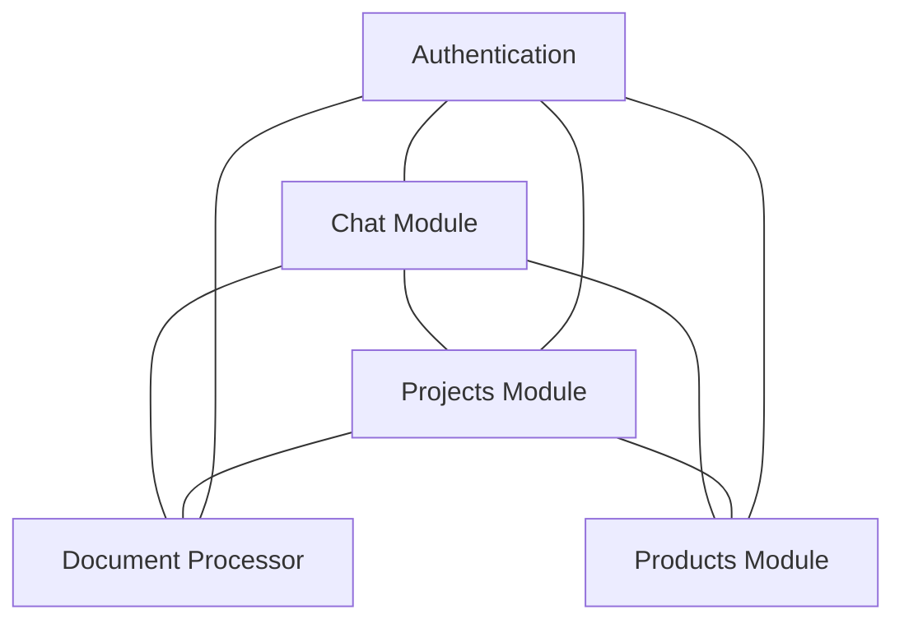

# QanDu AI Platform - Module Connections Map

This document outlines the specific connection points between the different modules of the QanDu AI Platform, providing a roadmap for integration and a reference for testing the connections between modules.

## Overview of Module Connections



## Connection Details

### 1. Chat ↔ Document Processor

#### Current Status: 🚧 In Development

#### Connection Components:
1. **Document Upload Component** in Chat Interface
   - Location: `src/components/chat/document-upload.tsx`
   - Purpose: Allow uploading documents directly from chat
   - API Endpoint: `POST /api/documents`

2. **Document Context Provider**
   - Location: `src/lib/document-context.ts`
   - Purpose: Fetch relevant document chunks based on user query
   - API Endpoint: `POST /api/documents/[id]/context`

3. **Enhanced System Prompt**
   - Location: `src/components/chat/chat-input-new.tsx`
   - Purpose: Inject document context into system prompt
   - Function: `handleSendMessage()`

#### Implementation Details:
```typescript
// Document upload in chat
const handleDocumentUpload = async (file: File) => {
  const formData = new FormData();
  formData.append('file', file);
  formData.append('workspace_id', 'default');
  
  const response = await fetch('/api/documents', {
    method: 'POST',
    body: formData
  });
  
  const data = await response.json();
  setActiveDocumentId(data.id);
};

// Get document context for a message
const getDocumentContext = async (query: string, documentId: string) => {
  const response = await fetch(`/api/documents/${documentId}/context?query=${encodeURIComponent(query)}`);
  return await response.json();
};
```

#### Testing Checklist:
- [ ] Document upload from chat interface
- [ ] Document context retrieval based on user queries
- [ ] Enhanced chat responses using document knowledge
- [ ] Document list display in chat sidebar
- [ ] Document switching within a chat session

---

### 2. Chat ↔ Projects Module

#### Current Status: 🚧 In Development

#### Connection Components:
1. **Project Command Handler**
   - Location: `src/lib/prompt-service.ts`
   - Purpose: Handle /project commands in chat
   - Function: `projectCommand.execute()`

2. **Project Context Selector**
   - Location: `src/components/chat/context-selector.tsx`
   - Purpose: Select a project to provide context for the conversation
   - State: `contextType === 'project'`

3. **Project Data Provider**
   - Location: `src/contexts/ProjectContext.tsx`
   - Purpose: Make project data available to chat component
   - Hook: `useProject()`

#### Implementation Details:
```typescript
// Project command implementation
const projectCommand = {
  name: 'project',
  description: 'Get information about or update a project',
  usage: '/project [id] [action]',
  execute: async (args: string[]) => {
    const [projectId, action = 'info'] = args;
    
    // Fetch project data from Supabase
    const { data: project } = await supabase
      .from('projects')
      .select('*')
      .eq('id', projectId)
      .single();
      
    // Handle different actions (info, tasks, update)
    switch (action) {
      case 'info':
        return { success: true, content: `Project: ${project.title}...` };
      case 'tasks':
        // Fetch and return tasks
        return { success: true, content: `Tasks for ${project.title}...` };
      // Other actions...
    }
  }
};
```

#### Testing Checklist:
- [ ] `/project list` command shows all projects
- [ ] `/project [id] info` shows project details
- [ ] `/project [id] tasks` shows project tasks
- [ ] Project context affects chat responses
- [ ] Project updates via chat commands work correctly

---

### 3. Chat ↔ Products Module

#### Current Status: 🚧 In Development

#### Connection Components:
1. **Product Command Handler**
   - Location: `src/lib/prompt-service.ts`
   - Purpose: Handle /product commands in chat
   - Function: `productCommand.execute()`

2. **Product Context Selector**
   - Location: `src/components/chat/context-selector.tsx`
   - Purpose: Select a product to provide context for the conversation
   - State: `contextType === 'product'`

#### Implementation Details:
```typescript
// Product command implementation
const productCommand = {
  name: 'product',
  description: 'Get information about products',
  usage: '/product [id] [action]',
  execute: async (args: string[]) => {
    const [productId, action = 'info'] = args;
    
    // Fetch product data from Supabase
    const { data: product } = await supabase
      .from('products')
      .select('*')
      .eq('id', productId)
      .single();
      
    // Handle different actions
    switch (action) {
      case 'info':
        return { success: true, content: `Product: ${product.name}...` };
      case 'features':
        return { success: true, content: `Features of ${product.name}...` };
      // Other actions...
    }
  }
};
```

#### Testing Checklist:
- [ ] `/product list` command shows all products
- [ ] `/product [id] info` shows product details
- [ ] `/product [id] features` shows product features
- [ ] Product context affects chat responses
- [ ] Product updates via chat commands work correctly

---

### 4. Projects ↔ Document Processor

#### Current Status: 🚧 In Development

#### Connection Components:
1. **Project Document Uploader**
   - Location: `src/app/projects/[id]/documents/page.tsx`
   - Purpose: Upload and manage documents for a specific project
   - API Endpoint: `POST /api/projects/[id]/documents`

2. **Project Workspace Creator**
   - Location: `src/app/api/projects/[id]/workspace/route.ts`
   - Purpose: Create and manage document workspaces for projects
   - API Endpoint: `POST /api/projects/[id]/workspace`

3. **Project Documents Table**
   - Database: `project_documents` table in Supabase
   - Purpose: Associate documents with projects

#### Implementation Details:
```typescript
// API route for project document upload
export async function POST(
  req: NextRequest,
  { params }: { params: { id: string } }
) {
  const formData = await req.formData();
  const file = formData.get('file') as File;
  
  // 1. Ensure project exists and user has access
  const { data: project } = await supabase
    .from('projects')
    .select('*')
    .eq('id', params.id)
    .single();
    
  if (!project) {
    return NextResponse.json({ error: 'Project not found' }, { status: 404 });
  }
  
  // 2. Create or get project workspace in document processor
  const workspaceResponse = await fetch(
    `${process.env.DOCUMENT_PROCESSOR_URL}/workspaces`,
    {
      method: 'POST',
      headers: {
        'Content-Type': 'application/json',
        'api-key': process.env.API_KEY as string
      },
      body: JSON.stringify({
        name: `Project: ${project.title}`,
        description: project.description
      })
    }
  );
  
  const workspace = await workspaceResponse.json();
  
  // 3. Upload document to workspace
  const docFormData = new FormData();
  docFormData.append('file', file);
  docFormData.append('workspace_id', workspace.id);
  
  const documentResponse = await fetch(
    `${process.env.DOCUMENT_PROCESSOR_URL}/documents/upload`,
    {
      method: 'POST',
      headers: {
        'api-key': process.env.API_KEY as string
      },
      body: docFormData
    }
  );
  
  const document = await documentResponse.json();
  
  // 4. Store document-project association in Supabase
  await supabase.from('project_documents').insert({
    project_id: params.id,
    document_id: document.id,
    filename: file.name
  });
  
  return NextResponse.json(document);
}
```

#### Testing Checklist:
- [ ] Document upload to a project works
- [ ] Project workspace creation works
- [ ] Documents are properly associated with projects
- [ ] Project documents are searchable
- [ ] Document deletion removes project association

---

### 5. Projects ↔ Products Module

#### Current Status: 🚧 Planned

#### Connection Components:
1. **Project-Product Association**
   - Location: `src/app/projects/[id]/products/page.tsx`
   - Purpose: Associate products with projects
   - Database: `project_products` table (to be created)

2. **Product Selection in Project**
   - Location: `src/components/projects/product-selector.tsx`
   - Purpose: Select products related to a project

#### Implementation Details:
```sql
-- SQL for creating project_products table
CREATE TABLE project_products (
  id UUID PRIMARY KEY DEFAULT uuid_generate_v4(),
  project_id UUID REFERENCES projects(id) ON DELETE CASCADE,
  product_id UUID REFERENCES products(id) ON DELETE CASCADE,
  created_at TIMESTAMP WITH TIME ZONE DEFAULT NOW(),
  UNIQUE(project_id, product_id)
);
```

```typescript
// Project-Product association component (placeholder)
export function ProductSelector({ projectId }: { projectId: string }) {
  const [products, setProducts] = useState<Product[]>([]);
  const [selectedProducts, setSelectedProducts] = useState<string[]>([]);
  
  useEffect(() => {
    // Fetch all products
    supabase.from('products').select('*').then(({ data }) => {
      setProducts(data || []);
    });
    
    // Fetch associated products
    supabase
      .from('project_products')
      .select('product_id')
      .eq('project_id', projectId)
      .then(({ data }) => {
        setSelectedProducts(data?.map(item => item.product_id) || []);
      });
  }, [projectId]);
  
  const toggleProduct = async (productId: string) => {
    // Toggle product selection logic
  };
  
  return (
    <div>
      <h3>Associated Products</h3>
      {products.map(product => (
        <div key={product.id}>
          <input
            type="checkbox"
            checked={selectedProducts.includes(product.id)}
            onChange={() => toggleProduct(product.id)}
          />
          {product.name}
        </div>
      ))}
    </div>
  );
}
```

#### Testing Checklist:
- [ ] Associate products with projects
- [ ] View associated products in project details
- [ ] Remove product associations
- [ ] Filter projects by product

---

## Database Schema for Module Connections

### Existing Tables
- `users` - Supabase Auth users
- `projects` - Project management
- `tasks` - Task management for projects
- `products` - Product catalog
- `product_features` - Product features
- `product_benefits` - Product benefits
- `product_categories` - Product categories

### Connection Tables (To Be Created)

#### 1. `user_documents`
```sql
CREATE TABLE user_documents (
  id UUID PRIMARY KEY DEFAULT uuid_generate_v4(),
  user_id UUID REFERENCES auth.users(id) ON DELETE CASCADE,
  document_id TEXT NOT NULL,
  filename TEXT NOT NULL,
  workspace_id TEXT NOT NULL,
  created_at TIMESTAMP WITH TIME ZONE DEFAULT NOW(),
  UNIQUE(user_id, document_id)
);
```

#### 2. `project_documents`
```sql
CREATE TABLE project_documents (
  id UUID PRIMARY KEY DEFAULT uuid_generate_v4(),
  project_id UUID REFERENCES projects(id) ON DELETE CASCADE,
  document_id TEXT NOT NULL,
  created_at TIMESTAMP WITH TIME ZONE DEFAULT NOW(),
  UNIQUE(project_id, document_id)
);
```

#### 3. `project_products`
```sql
CREATE TABLE project_products (
  id UUID PRIMARY KEY DEFAULT uuid_generate_v4(),
  project_id UUID REFERENCES projects(id) ON DELETE CASCADE,
  product_id UUID REFERENCES products(id) ON DELETE CASCADE,
  created_at TIMESTAMP WITH TIME ZONE DEFAULT NOW(),
  UNIQUE(project_id, product_id)
);
```

#### 4. `chat_context`
```sql
CREATE TABLE chat_context (
  id UUID PRIMARY KEY DEFAULT uuid_generate_v4(),
  chat_id TEXT NOT NULL,
  context_type TEXT NOT NULL, -- 'project', 'product', 'document'
  context_id TEXT NOT NULL,
  created_at TIMESTAMP WITH TIME ZONE DEFAULT NOW()
);
```

## Integration Implementation Plan

### Phase 1: Chat ↔ Document Processor
1. Implement document upload component in chat
2. Create API gateway in Next.js for document processor
3. Implement document context retrieval for chat
4. Add document reference to chat messages

### Phase 2: Projects ↔ Document Processor
1. Create project workspaces in document processor
2. Build document management interface for projects
3. Implement project-document associations
4. Add document search within projects

### Phase 3: Chat ↔ Projects/Products
1. Implement chat commands for projects and products
2. Create context selector for chat
3. Build system prompt enhancer with project/product context
4. Add project/product update capabilities via chat

### Phase 4: Unified Experience
1. Create cross-module dashboard
2. Implement cross-module search
3. Build notification system for cross-module events
4. Add analytics for cross-module usage

## Testing Connection Points

When testing connections between modules, follow these steps:

1. **Test Individual Module Functionality First**
   - Ensure each module works correctly in isolation
   - Verify APIs return expected responses
   - Check database operations succeed

2. **Test Simple Integration Points**
   - Test data flow between two connected modules
   - Verify data integrity across module boundaries
   - Check error handling for cross-module operations

3. **Test Complete Workflows**
   - Test end-to-end user journeys that span multiple modules
   - Verify state is maintained correctly across modules
   - Check performance when modules interact

4. **Document Connection Issues**
   - Note any failures in module connections
   - Document the specific integration point that failed
   - Track the data flow that caused the issue 